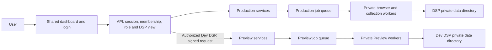

# Architecture

## Request flow



The API authorizes every request. Login creates a hashed, revocable server-side
session. A selected DSP receives a session-bound signed view token containing its
identity and authorization generation. Membership changes, DSP suspension and
settings revisions invalidate old views. The UI switches workspaces without
sharing employee caches between DSP components.

Platform owners can support all DSPs; opening a DSP records an audit event.
DSP owners manage memberships, settings and connections. Managers collect data.
Members read workforce data. An owner can belong to multiple DSPs and switch
between their authorized workspaces.

## Private state

```text
dispatch-platform/
  dev/                              Editable source repository
  dashboard/ api/ services/ tooling/ Future built application directories
  node_modules/                     One shared set of runtime dependencies
  preview/                          Independently selected candidate artifact
  dsps/dsp_<random-id>/
    config/                         Reserved per-DSP configuration files
    data/dispatch.sqlite            Connection/schedule settings and workforce
    secrets/vault.key               Per-DSP credential encryption key
    secrets/paycom.enc               DSP-bound encrypted provider credentials
    state/browsers/paycom/           Persistent private provider browser profile
  local/platform/                   Accounts, memberships, audit, release registry
  local/production/                 Production jobs, worker runs, process lock
  local/preview/                    Preview jobs, worker runs, process lock
  archive/                          Retained previous workspace
```

DSP directories contain no executables, dashboard copies, plugin installations,
package managers, or service definitions. DSP creation inserts a provisioning
record, creates private directories and schemas, and activates the DSP. A failed
provision can be retried. Browser binaries and provider logic are shared.

## Collection

1. An authorized user or daily scheduler creates an idempotent durable job with
   the DSP ID, initiating actor, environment and credential generation.
2. A bounded worker pool claims jobs fairly and permits one active job per DSP.
3. The auth broker reads that DSP’s credentials and opens only its provider
   profile. Challenges pause the job for an authorized owner to complete.
4. A collection worker in a separate process/filesystem/network namespace gets
   a private connection to that browser. It cannot open the profile, vault, host
   home, platform database, or another DSP’s browser.
5. The worker reads the provider’s employee roster and current pay-period data.
   The adapter validates identity, dates and response completeness. The database
   switches its active publication only after the complete result validates.
6. Jobs retain status, progress, attempts and an audit trail. Cancellation,
   suspension or changed credentials prevent the job from publishing. Crashed
   leases recover; eligible transient failures retry with backoff.

Default capacity is two browser sessions per environment. Verification expires
after ten minutes; native collection has a thirty-minute deadline. A ready
connection indicates the last successful verification, not a permanently running
browser. Profile cookies are restored on the next temporary session.

## Preview and promotion

The permanent Dev DSP belongs to Preview. The production gateway validates the
user’s DSP view before signing and forwarding Dev API requests to Preview. A
Dev workspace can load the candidate dashboard from `/preview/`; its assets are
also served through the gateway. Production DSPs continue using the production
artifact. Direct Preview requests require the gateway proof.

Preview and Production have separate code, job databases, process locks, worker
pools, and DSP profiles. They share the trusted account/membership registry and
audit log; they are not separate trust domains for malicious application code.
Provider/browser workers receive an OS-enforced boundary from that trusted code.

A candidate must be current on Preview and explicitly marked tested before
Production can use it. Promotion activates the same immutable digest, rather than
rebuilding. Shared production services then serve every production DSP. Process
replacement entails a short maintenance window. Private state and archives are
outside the managed code inventory and are never replaced by activation.
