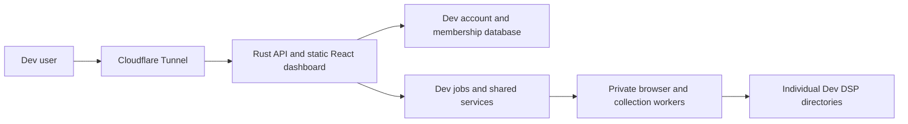

# Architecture

## Request flow



A single Rust process serves the Axum/Tokio API and static dashboard. Rust owns
accounts, sessions, DSPs, credential encryption, browser orchestration, jobs,
scheduling, publication, mail and operational commands. Only isolated provider
workers use Node/Playwright. The API authorizes every request. Login creates a hashed, revocable server-side
session. A selected DSP receives a session-bound signed view token containing its
identity and authorization generation. Membership changes, DSP suspension and
settings revisions invalidate old views. The UI switches workspaces without
sharing employee caches between DSP components.

Platform owners can support all DSPs; opening a DSP records an audit event.
DSP owners manage memberships, settings and connections. Managers collect data.
Members read workforce data. An owner can belong to multiple DSPs and switch
between their authorized workspaces.

## Private state

```text
dispatch-platform/
  dev/live/                         Repository on dev; compiled runtime in .build/
  dev/config/                       Private environment/tunnel configuration
  dev/data/platform/                Accounts, memberships, audit, keys, update receipts
  dev/data/preview/                 Dev jobs and worker runs
  dev/dsps/dsp_<random-id>/
    config/                         DSP configuration files
    data/dispatch.sqlite            DSP profile and storage-layout metadata
    data/paycom/paycom.sqlite       Paycom settings, schedule and workforce
    secrets/vault.key               Per-DSP credential encryption key
    secrets/paycom.enc               DSP-bound encrypted provider credentials
    state/browsers/paycom-browseros/           Persistent private provider browser profile
  archive/                          Retained previous workspace
```

The future Production environment uses the same layout under `public/`, with no
shared private state. `live/` contains code only. Account identities have separate
first and last names; there is no display-name field.

DSP directories contain no executables, dashboard copies, plugin installations,
package managers, or service definitions. DSP creation inserts a provisioning
record, creates private directories and schemas, and activates the DSP. A failed
provision can be retried. Browser binaries and provider logic are shared.

Collector storage uses typed provider access and independently versioned schemas.
See [Collector storage](COLLECTORS.md) for table ownership, the two-deployment
migration, rollback compatibility and the contract for adding collectors. During
the compatibility deployment, existing DSPs retain the legacy combined database
until the subsequent migration-enabled build starts.

## Collection

1. An authorized user or daily scheduler creates an idempotent durable job with
   the DSP ID, initiating actor, environment and credential generation.
2. A bounded worker pool claims jobs fairly and permits one active job per DSP.
3. The auth broker reads that DSP’s credentials and opens only its provider
   profile. Challenges pause the job for an authorized owner to complete.
4. A collection worker in a separate process/filesystem/network namespace gets
   a private connection to that browser. It cannot open the profile, vault, host
   home, platform database, or another DSP’s browser.
5. The worker reads the provider’s employee roster and current pay-period data.
   The adapter validates identity, dates and response completeness. The database
   switches its active publication only after the complete result validates.
6. Jobs retain status, progress, attempts and an audit trail. Cancellation,
   suspension or changed credentials prevent the job from publishing. Crashed
   leases recover; eligible transient failures retry with backoff.

Default capacity is two browser sessions per environment. Verification expires
after ten minutes; native collection has a thirty-minute deadline. A ready
connection records the last successful verification. Ready browsers idle for
sixty seconds are closed. Profile cookies are restored on the next temporary session.

## Dev builds and releases

The permanent Dev DSP and all test DSPs belong to the independent Dev platform.
It owns its login, account schema, owner dashboard, jobs and provider sessions.
Only independent platforms are supported (`DISPATCH_STANDALONE=1`). The Node
gateway, API, supervisor and operational CLI have been removed.

Feature PRs merge into `dev` on the owner's instruction. Successful push checks
upload one verified build; the Dev timer installs only the current merged commit's
artifact. The runtime and checkout update together, with health verification,
code rollback and interrupted-update recovery. Normal updates preserve private state. The initial Rust schema transition has an
explicit, authorized fresh-state reset with rollback before final verification.

The owner requests a release after testing. The final versioned candidate is
verified, its source merges into `main`, and its exact artifact is published.
Production publication/deployment automation is deferred to the Production setup.

## Efficiency and limits

Four database workers share a bounded queue of 64 operations with a two-second
admission timeout. Writes serialize short state transitions; reads can run
concurrently. Each worker reuses platform/job connections, caches prepared
statements and retains at most four DSP/core or collector database connections with 512 KiB SQLite
page caches. Employee filtering, Unicode ordering and pagination run in SQLite.
Password verification has a separate two-operation limit. Each browser session
accepts at most 32 pending commands; commands revalidate authority after waiting.
See [Rust migration](RUST-MIGRATION.md) for repeatable measurements and limitations.
